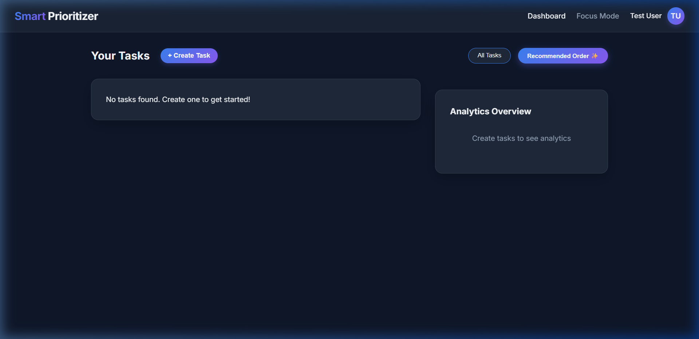
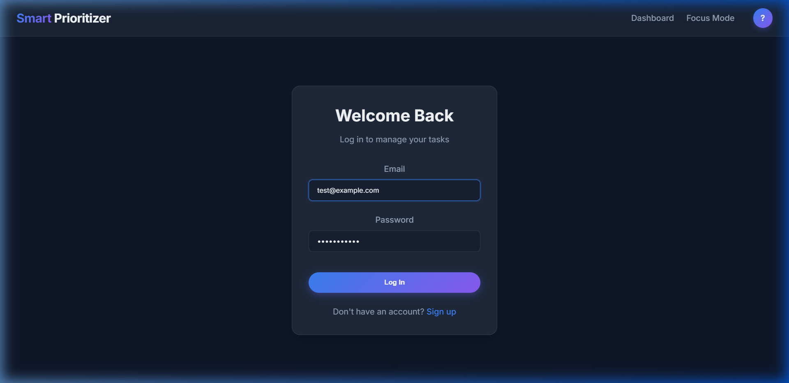
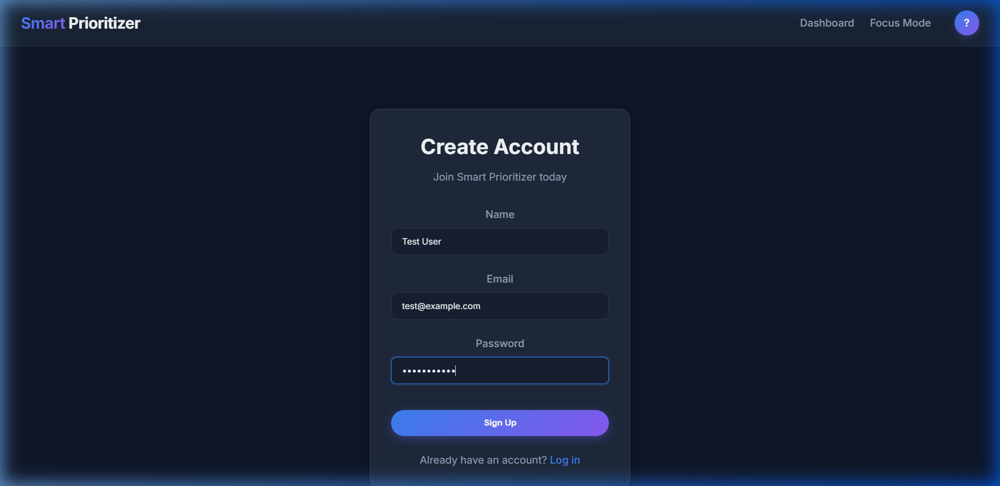

# Smart Task Prioritizer

A multi-layered system designed to help users manage tasks intelligently by leveraging ML insights for prioritization, alongside productivity-enhancing features like Focus Mode.

## System Architecture
- **Frontend**: Angular 19+ (Standalone components, reactive forms, modern CSS glassmorphism).
- **Backend**: Node.js, Express, TypeScript, Prisma ORM (SQLite).
- **ML Service**: Python, FastAPI.

## Developer Guide

### Prerequisites
- Node.js (v18+)
- Python (3.9+)
- Angular CLI (`npm i -g @angular/cli`)

### Setup Instructions

1. **Backend**
   ```bash
   cd backend
   npm install
   cp .env.example .env
   # Update JWT_SECRET in .env before starting the server.
   npx prisma generate
   npx prisma db push
   npm run dev
   ```
   *Runs on http://localhost:3000*

2. **ML Service**
   ```bash
   cd ml-service
   python -m venv venv
   source venv/Scripts/activate # Windows: venv\Scripts\activate
   pip install fastapi uvicorn pydantic pandas numpy scikit-learn
   python -m uvicorn main:app --host 0.0.0.0 --port 8000
   ```
   *Runs on http://localhost:8000*

3. **Frontend**
   ```bash
   cd frontend
   npm install
   npx ng serve
   ```
   *Runs on http://localhost:4200*

### Environment Configuration
- Backend configuration lives in `backend/.env`. `JWT_SECRET` is required; the server will not start without it.
- The backend allows CORS from `FRONTEND_URL` and calls the ML service at `ML_SERVICE_URL`.
- Frontend API URLs live in `frontend/src/environments/environment.ts` for local development and `frontend/src/environments/environment.prod.ts` for production builds.
- SQLite `.db` files are local runtime files and should not be committed.

## User Guide
1. **Account Creation**: Navigate to `/signup` to create a new user. Log in to access your dashboard.
2. **Dashboard**: Create tasks with titles, deadlines, and priorities (1-Low, 2-Medium, 3-High).
3. **Smart Prioritization**: Click "Recommended Order ✨" to have the ML service rank your tasks dynamically based on urgency and priority.
4. **Focus Mode**: Navigate to "Focus Mode" to trigger a Pomodoro timer. Work sessions and interruptions are automatically tracked and logged to the database.

## Recent Enhancements

We have recently upgraded the Task Prioritizer with the following enhancements:

### 1. Modern Dashboard Layout
- **Task Creation Modal**: Replaced the static, space-consuming task creation form on the left with a clean popup modal triggered by the "+ Create Task" button in the header.
- **Task Editing**: Added an inline edit button (`✎`) to each task card, allowing users to edit titles, descriptions, deadlines, and priorities.
- **Top-Right Analytics Widget**: Shifted the Analytics Overview (completion rate circular gauge and priority breakdown bar charts) to the top-right sidebar of the layout for a balanced, modern visual presentation.

#### Dashboard Preview:


### 2. Profile Dropdown & Self-Service
- **Interactive Avatar & Dropdown**: Replaced the plain "Logout" button in the navbar with a profile container showing the user's name next to a circular initials avatar. Clicking it opens a dropdown menu containing **Edit Profile**, **Change Password**, and **Logout**.
- **Edit Profile**: Allows updating name and email securely, with robust auto-population logic.
- **Change Password**: A secure dedicated change password flow that validates password matching in real-time on the frontend and verifies the user's current password against the stored bcrypt hash on the backend.

#### Authentication Preview:
| Login Screen | Registration Screen |
| :---: | :---: |
|  |  |

---
*Screenshots of the updated layout and features are located in [docs/screenshots](docs/screenshots).*

