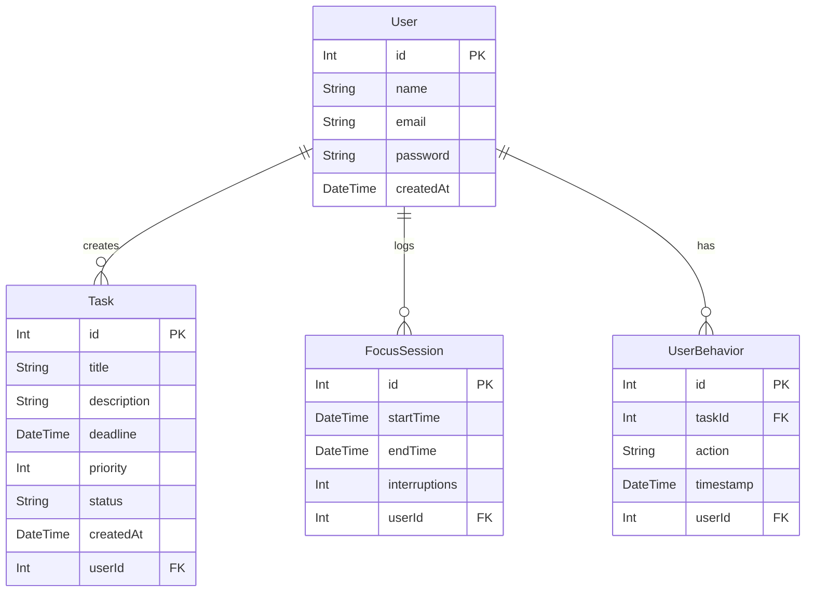

# Database Entity Relationship Diagram

```mermaid
erDiagram
    User ||--o{ Task : "creates"
    User ||--o{ FocusSession : "logs"
    User ||--o{ UserBehavior : "has"

    User {
        Int id PK
        String name
        String email
        String password
        DateTime createdAt
    }

    Task {
        Int id PK
        String title
        String description
        DateTime deadline
        Int priority
        String status
        DateTime createdAt
        Int userId FK
    }

    FocusSession {
        Int id PK
        DateTime startTime
        DateTime endTime
        Int interruptions
        Int userId FK
    }

    UserBehavior {
        Int id PK
        Int taskId FK
        String action
        DateTime timestamp
        Int userId FK
    }
```
